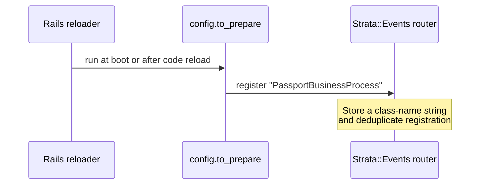
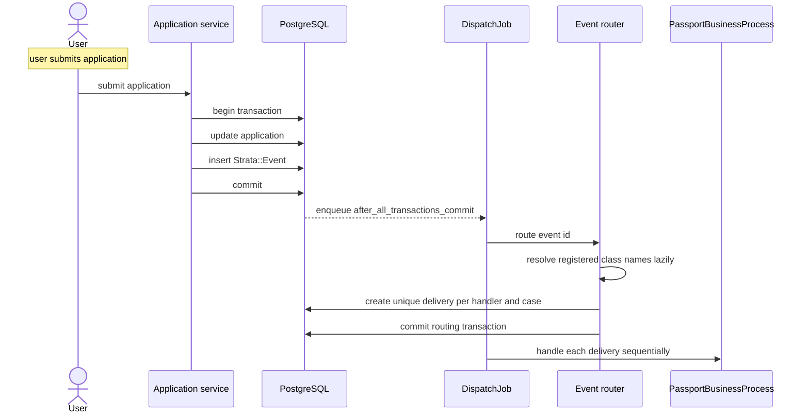
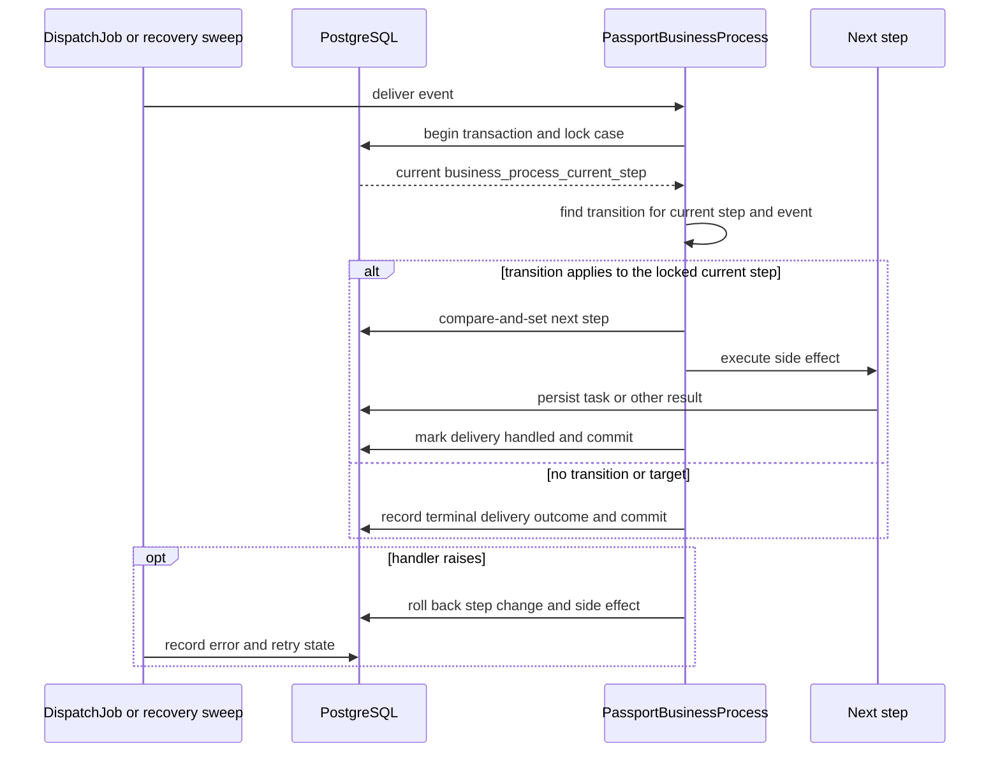

# Business process sequence diagram

## Initialization

```mermaid
sequenceDiagram
  participant Rails as Rails reloader
  participant Config as config.to_prepare
  participant Router as Strata::Events router

  Rails ->> Config: run at boot or after code reload
  Config ->> Router: register "PassportBusinessProcess"
  note over Router: Store a class-name string<br/>and deduplicate registration
```

## Publish and dispatch

```mermaid
sequenceDiagram
  actor U as User
  participant App as Application service
  participant DB as PostgreSQL
  participant Job as DispatchJob
  participant Router as Event router
  participant BP as PassportBusinessProcess

  note over U: user submits application
  U ->> App: submit application
  App ->> DB: begin transaction
  App ->> DB: update application
  App ->> DB: insert Strata::Event
  App ->> DB: commit
  DB -->> Job: enqueue after_all_transactions_commit
  Job ->> Router: route event id
  Router ->> Router: resolve registered class names lazily
  Router ->> DB: create unique delivery per handler and case
  Router ->> DB: commit routing transaction
  Job ->> BP: handle each delivery sequentially
```

## Handle a business-process delivery

```mermaid
sequenceDiagram
  participant Job as DispatchJob or recovery sweep
  participant DB as PostgreSQL
  participant BP as PassportBusinessProcess
  participant Step as Next step

  Job ->> BP: deliver event
  BP ->> DB: begin transaction and lock case
  DB -->> BP: current business_process_current_step
  BP ->> BP: find transition for current step and event
  alt transition applies to the locked current step
    BP ->> DB: compare-and-set next step
    BP ->> Step: execute side effect
    Step ->> DB: persist task or other result
    BP ->> DB: mark delivery handled and commit
  else no transition or target
    BP ->> DB: record terminal delivery outcome and commit
  end
  opt handler raises
    BP ->> DB: roll back step change and side effect
    Job ->> DB: record error and retry state
  end
```
