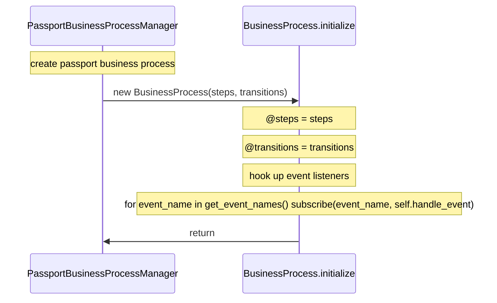
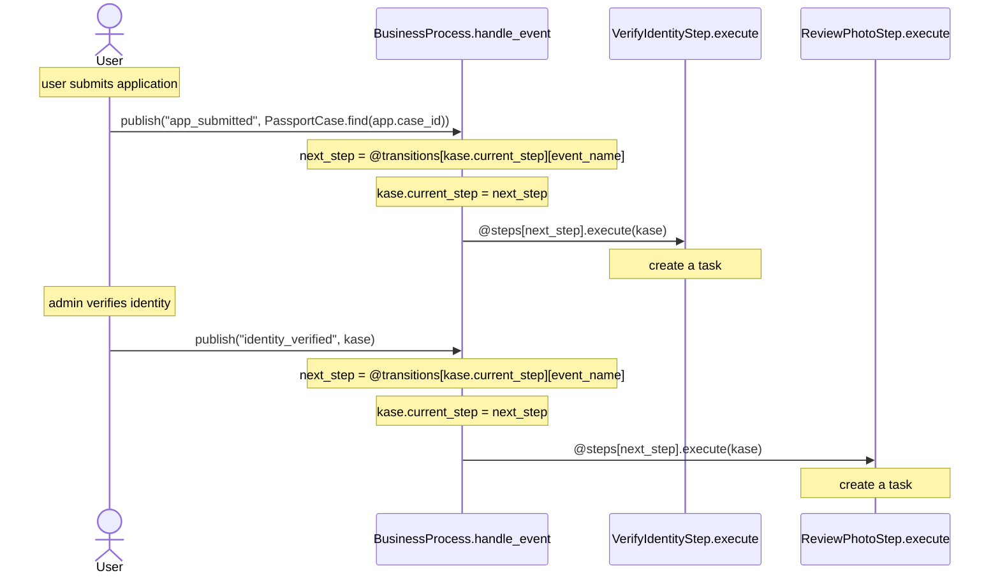

# Business process sequence diagram

## Initialization

```mermaid
sequenceDiagram
  participant PBPM as PassportBusinessProcessManager
  participant BP as BusinessProcess.initialize

  note over PBPM: create passport business process
  PBPM ->> BP: new BusinessProcess(steps, transitions)
  note over BP: @steps = steps
  note over BP: @transitions = transitions
  note over BP: hook up event listeners
  note over BP: for event_name in get_event_names() subscribe(event_name, self.handle_event)

  BP ->> PBPM: return
```

## Response to event

```mermaid
sequenceDiagram
  actor U as User
  participant BP as BusinessProcess.handle_event
  participant V as VerifyIdentityStep.execute
  participant R as ReviewPhotoStep.execute

  note over U: user submits application
  U ->> BP: publish("app_submitted", PassportCase.find(app.case_id))

  note over BP: next_step = @transitions[kase.current_step][event_name]
  note over BP: kase.current_step = next_step

  BP ->> V: @steps[next_step].execute(kase)
  note over V: create a task

  note over U: admin verifies identity
  U ->> BP: publish("identity_verified", kase)

  note over BP: next_step = @transitions[kase.current_step][event_name]
  note over BP: kase.current_step = next_step

  BP ->> R: @steps[next_step].execute(kase)
  note over R: create a task
```
