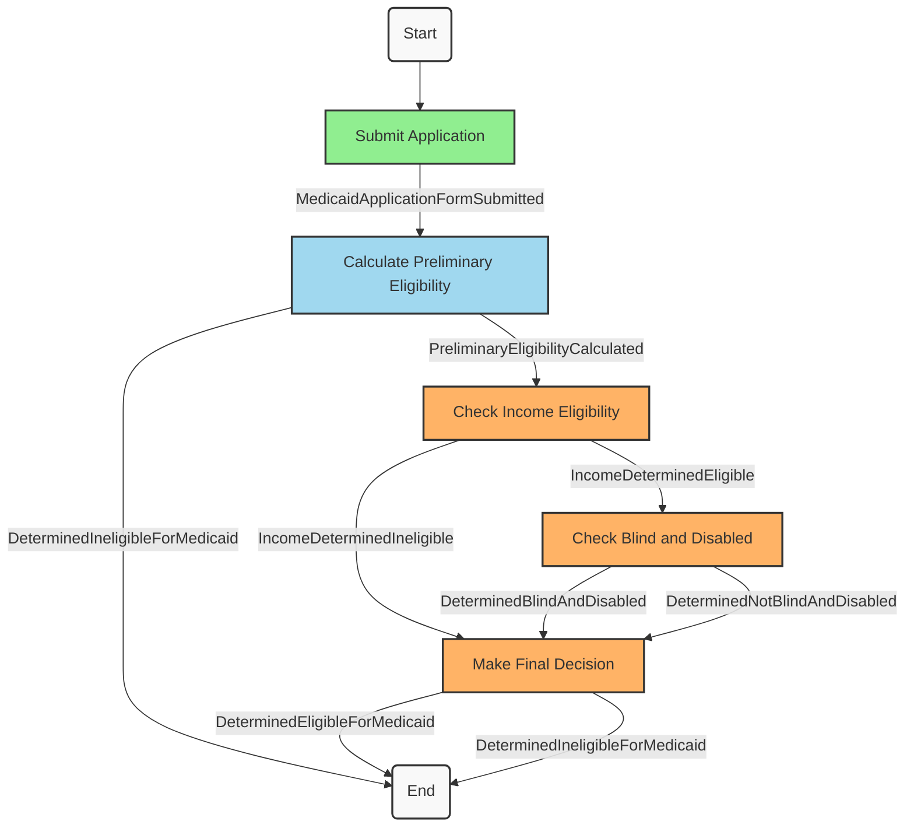

# Flex SDK Components

1. Flex Data Modeler
2. Multi-Page Form Builder
3. Business Process Modeler
4. Task Management System
5. Policy as Code Rules Engine
6. Master Person Record

## Flex Data Modeler

Use Flex Data Modeler to define the data model for your application.

- Define fields that are common across many government systems with only a few lines of code.
- Minimize custom code by leveraging built-in validation logic
- Ensure data interoperability by leveraging Flex data standards.

For example, to collect name and address from your applicants would previously have required something like this:

```ruby
attribute :first_name, :string, required: true
attribute :middle_name, :string
attribute :last_name, :string, required: true
attribute :residential_street_address_line_1, :string, required: true
attribute :residential_street_address_line_2, :string
attribute :residential_city, :string, required: true
attribute :residential_state, :string, required: true
attribute :residential_zip_code, :string, required: true
attribute :mailing_street_address_line_1, :string
attribute :mailing_street_address_line_2, :string
attribute :mailing_city, :string
attribute :mailing_state, :string
attribute :mailing_zip_code, :string
```

With Flex Attributes, you can define the same fields with just a few lines of code:

```ruby
flex_attribute :name
flex_attribute :residential_address, :address
flex_attribute :mailing_address, :address
```

## Multi-Page Form Builder

Use Flex Form Builder to create multi-page forms with ease. The Form Builder leverages the [task list design pattern](https://navasage.atlassian.net/wiki/spaces/PL/pages/445382671/Task+list) to create more complex forms with multiple chapters or sections (see also [USWDS Step Indicator](https://designsystem.digital.gov/components/step-indicator/)).

[The Multi-Page Form Builder is on the roadmap in Linear](https://linear.app/nava-platform/project/multi-page-application-form-flow-99f38344c043)

## Business Process Modeler

Use Flex Business Process Modeler to define business processes for managing cases. 

- Define applicant tasks, staff tasks, and automated system processes
- Define custom task types for your staff tasks
- Leverage an event-based architecture to define transitions between steps in your business process in a scalable way

For example, the following code defines a business process for Medicaid eligibility determination:

```ruby
MedicaidBusinessProcess = Flex::BusinessProcess.define(:medicaid, MedicaidCase) do |bp|
  # Steps
  bp.applicant_task("submit_application")
  bp.system_process("calculate_preliminary_eligibility", ->(kase) {
    ...
  })
  bp.staff_task("check_income_eligibility", MedicaidCheckIncomeEligibilityTask)
  bp.staff_task("check_blind_and_disabled", MedicaidCheckBlindAndDisabledTask)
  bp.staff_task("make_final_decision", MedicaidMakeFinalDecisionTask)

  # Start step
  bp.start_on_application_form_created("submit_application")

  # Transitions
  bp.transition("submit_application", "MedicaidApplicationFormSubmitted", "calculate_preliminary_eligibility")
  bp.transition("calculate_preliminary_eligibility", "PreliminaryEligibilityCalculated", "check_income_eligibility")
  bp.transition("calculate_preliminary_eligibility", "DeterminedIneligibleForMedicaid", "end")
  bp.transition("check_income_eligibility", "IncomeDeterminedEligible", "check_blind_and_disabled")
  bp.transition("check_income_eligibility", "IncomeDeterminedIneligible", "make_final_decision")
  bp.transition("check_blind_and_disabled", "DeterminedBlindAndDisabled", "make_final_decision")
  bp.transition("check_blind_and_disabled", "DeterminedNotBlindAndDisabled", "make_final_decision")
  bp.transition("make_final_decision", "DeterminedEligibleForMedicaid", "end")
  bp.transition("make_final_decision", "DeterminedIneligibleForMedicaid", "end")
end
```



Legend:

- 🟩 Green: Applicant Tasks
- 🟦 Blue: System Processes
- 🟧 Orange: Staff Tasks

## Task Management System

Use the Flex Task Management System to define custom tasks for your staff.

- Define custom task types for your staff tasks
- Define custom views
- Define custom actions

## Policy as Code Rules Engine

Use Flex Rules Engine to encode policy as code.

- Use the same rules to power both official determinations as well as public calculators. For example the [Massachsuetts Paid Family and Medical Leave Benefits Calculator](https://calculator.eol.mass.gov/pfml/yourbenefits/) provides a way for applicants to estimate their weekly benefits before creating an account or applying. Going forward we can use the same rules to power both the calculator and the official determination to ensure accuracy of these estimates.
- Leverage shared rules across programs. For example, Paid Leave eligibility in Massachusetts cites minimum wages earned as defined by Unemployment Insurance policy. Use the unemployment insurance rules directly rather than re-implementing them.

## Master Person Record

Use Flex Master Person Record to create a single, unified view of a person across multiple systems. This allows for better data management and reduces duplication of information.
