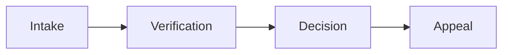
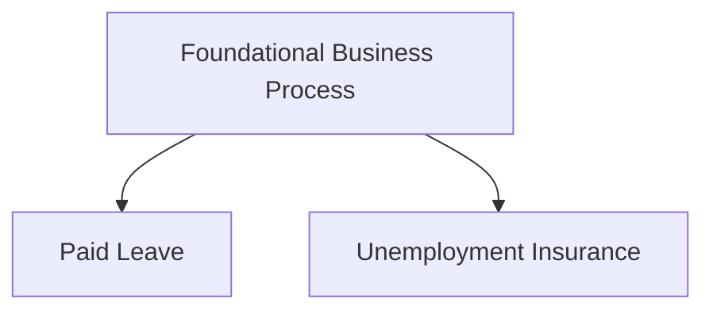
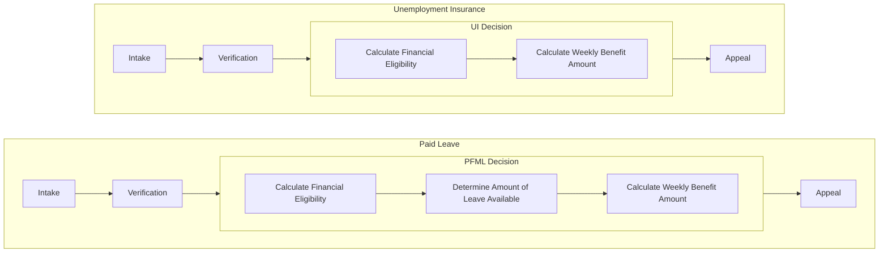
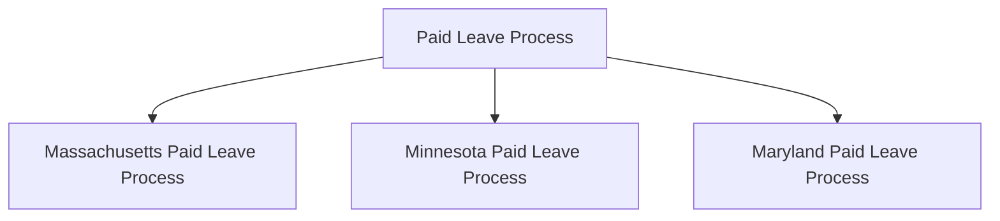

# Business process family tree

Many business processes share common steps and transitions. This document describes the family tree of business processes, showing how they inherit from each other.

## Foundational business process for all government services

At the root is the business process for a government service. It involves an application step, also known as intake, where the user submits their application. The next step is typically to verify the user's identity, which is a common requirement for many government services. The process then continues with a verification step, where the submitted documents are checked for completeness and correctness. Finally, the process concludes with a decision step, also known as determination or adjudication, where the application is either approved or rejected. After the decision, a dispute or appeal step may be initiated if the user disagrees with the decision.

## Program specific business processes

Specific programs will inherit from the foundational business process but will elaborate on the specifics aspects of the process. For example, a paid leave program's "Decision" subprocess may involve calculating financial eligibility, determining the amount of leave available, and calculating the weekly benefit amount. An unemployment insurance program's "Decision" subprocess may be different.

The following diagram shows the inheritance of business processes for different programs, such as paid leave and unemployment insurance, from the foundational business process.

## State specific business processes

State specific business processes will inherit from the program specific business processes. For example, paid leave programs for Massachusetts, Minnesota, and Maryland can all inherit from the base paid leave program's business process and add, remove, change, or replace steps in the business process.

## Family trees for subprocesses

There are also common subprocesses between programs. For example, the "Verify Identity" step is common across many programs, but the specific implementation may vary. Similar to the government digital service application process, we can have an entire family tree of the "verify identity" process subprocesses that represent different common variations of the process. And individual implementations can inherit from these common subprocesses and make their own modifications, adding, removing, or replacing steps.
